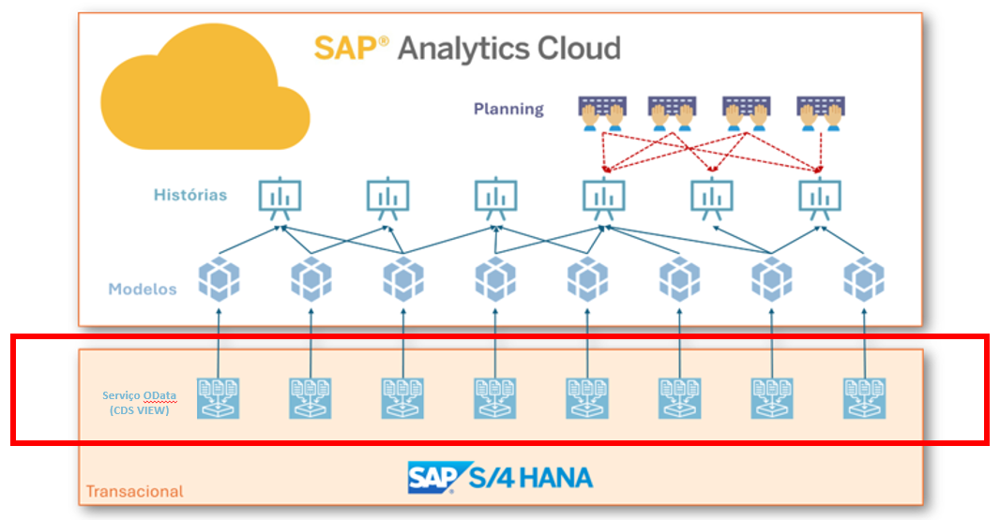

<h1 align="center"> import_from_s4hana_to_analytics </h1>

 
 

## 📃 Descrição
Materiais e Exemplos de serviços OData desenvolvidos utilizando CDS Views ou ABAP para a importação de dados do SAP S/4HANA para o SAP Analytics Cloud, SAP Datasphere ou outros aplicativos analíticos.

 
 

## 🕹️ Como utilizar esse repositório?
É bem intuitivo: navegue entre as pastas e explore os exemplos de CDS Views, código ABAP, queries, etc. Junto com os demais materiais de estudo, busque analisar e praticar até internalizar os conceitos.
* <a href="/1_odata_moderno (cds_view)/">Exemplos de Serviço OData Moderno (CDS VIEW)</a>  
* <a href="/2_odata_classico (segw)/">Exemplos de Serviço OData Clássico (SEGW)</a>  
* <a href="/3_utilitarios/queries_sql (dbacockpit)/">Exemplos de Query SQL (DBACOCKPIT)</a>

 
 

## 🧑‍🏫 Materiais de Estudo & Documentação
<i>⚠️ Atenção: Este manual está disponível apenas para leitura direta via o link informado. Não é permitido o download ou qualquer tentativa de acesso não autorizado ao arquivo. Peço gentilmente que não insista utilizando métodos ilícitos.</i> 
* <a href="https://docs.google.com/document/d/1I8FJz42Zx-0dgNBhQBbb6iRIRSaiEERb/edit?usp=sharing&ouid=104305491820617169968&rtpof=true&sd=true">Manual: Como importar dados do S/4HANA para o SAP Analytics Cloud? (PDF)</a>  
* <a href="https://www.linkedin.com/pulse/importando-dados-do-s4hana-para-o-sap-analytics-cloud-argel-capela-gx7ff">Artigo Linkedin: Importando dados do S/4HANA para o SAP Analytics Cloud com OData</a>  

 
 

## 🤝 Colaboradores
<table>
  <tr>
    <td align="center">
      <a href="http://github.com/argelcapela">
         
        
          <b>Argel Capela</b>
        
      </a>
    </td>
  </tr>
</table>

 
 

## 🎯 Status do projeto
* Concluído em versão 1.0

 
 

## 🦟 Erros/Feedback
Identificou algum erro ou tem alguma sugestão? Por favor me informe, fico feliz em seguir aprendendo mais e melhorando.
 
 

## 🔐 Licença
<a href="LICENSE">GNU AFFERO GENERAL PUBLIC LICENSE, Copyright (c) 2024 Argel Capela</a>
